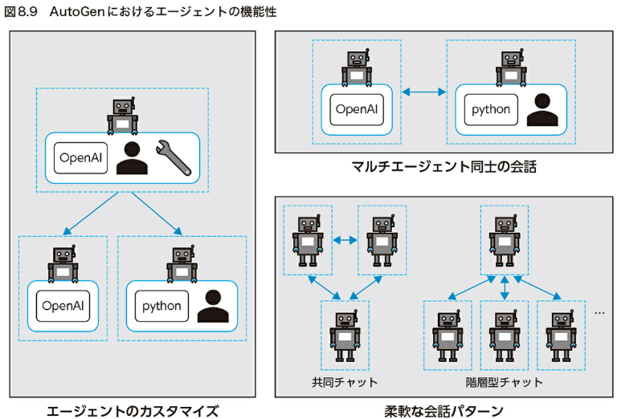

LangChainとLangGraphによるRAG・AIエージェント［実践］入門 

# 8章
## AIエージェントの起源とLLMを使ったAIエージェントの変遷
1990年代には「過去の文脈から次の単語を予測する」統計的言語モデル（Statistical LM）が、2013年には「単語の意味は周辺文脈から形成される」という分布仮説に基づいて単語を分散表現とするWord2Vecの出現によりニューラル言語モデル（Neural LM）が主流となりましたが、この頃の言語モデルのタスク解決能力は、テキスト解析や感情分析など限定的なものでした。 

2018年にはBERTやGPTなど、大規模なコーパスで事前学習されたTransformerベースの言語モデル（Pre-trained LM）が登場したことで現実的な課題解決能力が上がり、2020年以降からスケーリング則の発見、指示学習、選好最適化などによりLLMが汎用的なタスク解決能力を獲得した、というのが現在に至るまでのおおまかな流れです。GPT-4に至っては、法律の試験において90%以上の法科学生よりもスコアが高かったことなどが衝撃とともに伝えられたりしました。

## Chain-of-Thoughtプロンプティング 
2022年には複雑な推論に対して、プロンプトで**中間的な推論ステップの実例を示すことで推論能力が向上する「Chain-of-Thoughtプロンプティング」**という手法が標準的なプロンプトに比べて複雑な指示を上手に解決できることが示されました。 
たとえば、「ロジャーはテニスボールを5個持っています。彼はもう2缶テニスボールを買いました。それぞれの缶にはテニスボールが3つずつ入っています。現在彼はいくつのテニスボールを持っているでしょうか？」という少し複雑な質問を用意します。 
標準的なプロンプトでは「答えは11個です。」と単純に回答のみを示したうえで「カフェテリアにりんごが23個あります。20個をランチのために使って、6個を買い足したとき、いくつのりんごがあるでしょうか？」という質問をします。 
一方で、Chain-of-Thoughtプロンプティングにおいては「はじめにロジャーは5つボールを持っています。2つの缶に3つずつボールが入ってるというのは、合わせて6つのテニスボールということです。5＋6＝11です。」という解法を示したうえで同じ質問を行います。 
すると、正解のりんごの数は9個であるのに対して、単純に答えを示しただけの標準的なプロンプトでは「答えは27です。」と答え、Chain-of-Thoughtプロンプティングでは「カフェテリアにはりんごがもともと23個ありました。ランチのために20個使ったので23－20＝3個になりました。さらに6個買ったので、3＋6＝9個になりました。答えは9個です。」と、示した解法と同様にステップバイステップで正しい回答を導くことができました。

## Reasoning and Acting（ReAct） 
Chain-of-Thoughtsなど比較的簡単な手法で複雑なゴールをタスク化する段取り能力が示されました。また、外部の行動生成能力と組み合わせることで文章生成以上のタスク実行が可能な性質が示されました。
これらLLMの推論能力と行動生成能力を組み合わせたアプローチとして「Reasoning and Acting（ReAct）」という手法が提案されました。 
行動計画の作成や調整を行うReasoning（推論）工程と、外部環境とのインタラクションを通じて、推論に必要な追加情報を取り込んだり、目的の外部実行を行うActing（行動）工程、そしてそのあとの環境状況の識別を交互に繰り返すことで、両者の相乗効果を引き出すことが可能になるという内容です。 
質問に回答させるテストでは「Apple Remote以外に、Apple Remoteがもともと操作できるように設計されたプログラムを制御できるデバイスがあるでしょうか。」という質問に対して、ReActアプローチのみが、調べるべきことを計画し、調べた結果を受けて正解を導くために次に調べるべきことを計画し、最終的に正しく「キーボードのファンクションキー」と回答できたことが示されました。

## Plan-and-Solveプロンプティング
2023年には、上記のZero-shot CoTでも発生する「計算ミス」「中間推論ステップの欠如」「意味の誤解」について、あらかじめ計画を立てて（タスクをサブタスクにすべて分割して）から、計画に従ってサブタスクを実行することで性能を上げることができる「Plan-and-Solveプロンプティング」という手法が提案されました。 
前述したZero-shot CoTでは「ステップバイステップで考えましょう。」という指示で段階的な推論を誘発させる一方で、単純な指示ゆえに推論が複雑化すると中間推論ステップにおける推論誤りなどが発生してしまいます。 
これに対して、Plan-and-Solveプロンプティングでは、はじめにゴールまでのタスクを適切なサブタスクに分割した計画を立ててから、その計画に従ってサブタスクを実行する方法を提案しています。この計画立案により中間推論ステップにおける推論誤りの発生を抑止し、最終的な推論性能の向上を図っています。

# 8.3　汎用LLMエージェントのフレームワーク
## AutoGPT AutoGPT
2023年4月にリリースされ、ReAct型のエージェントとしていち早く話題となったOSSのツールです。
GPT-4モデルが公開され、同時にOpenAIから高度な推論とタスク解決能力について解説した論文（GPT-4 Technical Report）が公開されたタイミングで考案・公開されたフレームワークです。 
AutoGPTを起動して「やりたいこと（達成したいゴール）」を設定したら、LLMに実行すべきことを決定・アクションさせ、そのアクションの結果をプロンプトにフィードバックすることを繰り返して指示したゴールの達成まで行動します。 
2024年8月時点でGitHubのスターが圧巻の16万★以上付いており、今でも毎日改善されており、この分野の注目の高さがうかがえます。 
最新版のAutoGPTでは、AutoGPT Builderというエージェントのワークフローを定義するフロントエンドが追加されています。

## AutoGen 
AutoGenはMicrosoft、ペンシルベニア州立大学、ワシントン大学が中心になって開発されている汎用的に使えるAIエージェントツールです。Python版と.NET版注の2パッケージがオープンソースソフトウェアとして開発されています。

## crewAI 
**crewAIのコアコンセプト**
crewAIは抽象化された次のようなモジュールの組み合わせによって自動化エージェントを実現します。使い勝手や抽象度合いがLangChainに似ている印象なので、LangChainを触ったことがある人はとっつきやすいと思います。
- **エージェント** 
役割と目標、およびそれらの背景情報を設定することで、タスクの決定・実行、または他のエージェントとのコミュニケーションを行うモジュールです。エージェントには、複数のLLMから利用対象を指定することや、タスクの実行に利用可能な外部ツールの指定をすることができます。 
- **タスク** 
タスクの詳細と、期待される出力、割り当てるエージェントの指定などが可能です。 
- **ツール** 
Web検索やデータ分析など、エージェントのタスク処理に利用できるツールの作成や外部ツールの統合などができます。
- **プロセス** 
タスクを順次実行したり、階層型に配置して実行するための定義体です。階層型プロセスは企業活動をエミュレートするような形式で、マネージャーエージェントを指定してタスクの割り当てや評価を委任することも可能です。また、今後はタスク実行に関する割り当てや内容をマルチエージェントによる共同意思決定によって調整する方式も計画されています。 
- **クルー** 
目標を達成するために協力する共同グループを表しており、タスク、エージェント、プロセスなどを束ねて全体的なワークフローを定義します。 
- **メモリ**
クルーに指定できるオプションで、最近のやりとりやタスク結果を一時保存する短期記憶や、過去複数の実行において正しかったことや間違ったことなどの洞察や学習を保存しておく長期記憶、タスク中に遭遇したエンティティ（人、場所、概念）などを整理しておくエンティティメモリ、それらの組み合わせで対話の文脈を記憶しておく文脈記憶の4種類をベクターデータとして管理する機能です。
- **計画** 
クルーが実行される前に、AgentPlannerがタスクを計画してエージェントのタスクに追加する機能です。 
- **トレーニング**
複数のエージェントやタスクで構成されるクルーの目標達成に向けて事前に複数回反復を行い、機能や知識を強化するための機能です。複雑な構成・目標に対して、より一貫性のある洞察と達成を目指すために利用可能です。

# 8.4 マルチエージェント
マルチエージェントについて、明確な定義は存在しませんが、広義には次の2つが含まれます。 
- **マルチステップなマルチエージェント**：一連の処理の中で、複数のシステムプロンプトを使って、役割やステップごとに別々のAIエージェントで処理を行う、ワークフローの最適化を目的とした処理形態 
- **マルチロールなマルチエージェント**：異なるペルソナや役割を持たせた複数のエージェントを、目的に向かって協調動作させる形態

## マルチエージェントでText-to-SQLの精度を上げる
LLMアプリのユースケースの1つであるText-to-SQLは、ユーザーが自然言語で入力した要求から複雑なSQLのクエリを生成するしくみです。たとえば「過去3年間の四半期ごとの売上トップ10製品と、その地域別内訳を教えて」などの入力からSQLのクエリを生成します。

### Text-to-SQLの基本手法：スキーマリンク＋クエリ生成
BIRD-SQLリーダーボードで4位に位置しているCHESS注23というフレームワークを題材に、LLMベースのText-to-SQLで代表的なスキーマリンク注24とクエリ生成の処理の流れを解説します。CHESSは主にエンティティとコンテキストの取得、スキーマの選択、SQL生成という3つの主要コンポーネントで構成されています。
エンティティとコンテキストの取得工程では、キーワードを検出し、ベクターデータベースを使用してデータベースから実データの値と、データベースカタログからメタデータを抽出します。CHESSの特徴は、多くのText-to-SQLがデータベースカタログ内のメタデータのみを利用するのに対して、実データと、ユーザーの指示内容の意味や構文の類似性の両方を利用することで、SQLクエリ生成の精度を高めている点です。スキーマ選択と呼ぶステップで、上記で取得した数百のテーブルや列の候補から、多くの場合、10未満の列セットに絞り込みます。これらの複数ステップを通じて、最小限かつクエリ生成に十分なテーブルと列のサブセットを抽出します。最後に、抽出されたデータベース情報をクエリ生成モジュールに渡し、SQLジェネレーターとしてファインチューニングされたモデルと、クエリの修正ステップを組み合わせて、抜け漏れなく精度高くSQLクエリを生成します。 スキーマ選択のステップにおいて、正しく選択できたかどうかをフィードバックすることで、精度を高めるしくみになっている点も注目ポイントです。

クエリ生成部分の精度を上げるためには、クエリを複雑度に応じて分類したうえで生成することが有効であると検証したのが、DEA-SQLというフレームワークです。

### マルチエージェントでソフトウェア開発を自動化する
##### MetaGPT
MetaGPT注33もChatDevと同様にマルチエージェントでソフトウェア開発会社をシミュレートするツールです。次の図のように役割とタスクを指定して役割に応じてタスクで生成した成果物を受け渡していくことで目標を達成します。

# 9章　LangGraphで作るAIエージェント実践
ユーザーの質問に答えるAIアシスタントのフロー図

