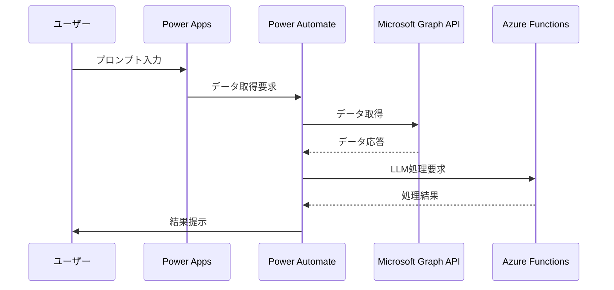

## Copilotによる設計～構築手順まで
Power PlatformとMicrosoft Graphを組み合わせたシステムの設計について、以下のように提案します。

## 要件定義
### 目的
- Microsoft Graphに保存されているデータを活用し、ユーザーのカレンダー、メール、チャット、ドキュメント、会議などの情報を安全に取り扱いながら、大規模言語モデル（LLM）を用いて自動化と効率化を図る。

### 機能要件
- ユーザーのプロンプトに応じて、Microsoft Graphからデータを取得。
- LLMを使用して、取得したデータに基づいて適切なアクションを提案または実行。
- データのセキュリティとプライバシーを保護。

### 非機能要件
- システムは24時間365日稼働する。
- ユーザーのデータはEUのGDPRなどのデータ保護法規を遵守する。

## 基本設計
### システム構成
- Power Apps: ユーザーインターフェースを提供。
- Power Automate: ワークフローとビジネスロジックを管理。
- Azure Functions: LLMとの連携を担当。
- Microsoft Graph API: データアクセス層。

### セキュリティ設計
- OAuth 2.0を使用した認証。
- データアクセスには、最小限の権限を持つサービスプリンシパルを使用。

## 詳細設計
### ユーザーインターフェース
- Power Appsを使用して、ユーザーが簡単にプロンプトを入力できるフォームを作成。

### ワークフロー

### データ保護
- すべてのデータは暗号化され、安全なストレージに保存。
- ユーザーの操作ログは、監査とトレーシングのために記録。

## 構築手順

### ステップ1: 環境の準備

#### 1. Microsoft 365 開発者プログラムへの登録
- **Microsoft 365 開発者プログラム**にアクセスし、登録を行います。
- 登録時には、**携帯電話番号**が必要です。これは、セキュリティのための認証コードを受け取るために使用されます。
- 国を**Japan**と選択し、会社名や言語などの基本情報を入力します。

#### 2. テナントの作成
- 登録が完了すると、**個人開発用テナント**を取得できます。テナントとは、Microsoftのサービスを利用するための個別の環境のことです。
- 新しいテナントが作成されたら、ドメイン名や管理者アカウントをメモしておきましょう。

#### 3. Power Apps 開発者プランへの登録
- 次に、**Power Apps 開発者プラン**のページにアクセスし、登録を行います。
- 「無料で始める」をクリックし、新しく作成したテナントのアカウントでサインインします。
- 国を**Japan**と選択し、電話番号などの必要情報を入力します。

#### 4. Power Platform 環境の確認
- Power Apps 開発者プランに登録が完了すると、**make.powerapps.com**にアクセスすることで、Power Platformの開発・テスト環境が表示されます。
- これで、Power Platformの開発・テストを行うための環境が用意されます。

#### 5. Azure アカウントの作成
- **Azure**の公式サイトにアクセスし、アカウントを作成します。
- Azure Functionsなど、Power Platformと連携するためのサービスを利用する準備をします。

### ステップ2: Power Appsの設定

#### 1. Power Appsの初期画面の起動
- Power AppsのWebサイトにアクセスし、サインインします。
- 初期画面で「**ホームタブ**」の「**キャンバスアプリを一から作成**」を選択します。

#### 2. アプリの作成
- 適当なアプリ名を決めて「**作成**」を押します。
- 形式はタブレットかスマートフォンを選択します。これによって、アプリの画面の大きさが異なります。

#### 3. 開発画面の構成
- 開発画面には、左側に「**ツリービュー**」、上部には「**ファイル**」「**ホーム**」「**挿入**」「**ビュー**」「**アクション**」などのタブがあります。
- 「**ツリービュー**」では、アプリ内の各項目（ボタン、画像など）を管理します。
- 「**挿入**」タブからは、新しいコントロール（ボタンやラベルなど）をアプリに追加できます。

#### 4. アプリの基本的な操作
- 新しい画面を追加するには、上部の「**新しい画面**」から選択します。
- 画面に「**ラベル**」を追加するには、「**挿入**」タブから「**テキストラベル**」を選択します。
- ラベルのテキストやプロパティは、右側のプロパティパネルから編集できます。

#### 5. アプリの保存と発行
- アプリが完成したら、左上の「**ファイル**」を押して保存します。
- 名前、アイコン、説明を決めたら、「**保存**」を押してアプリを保存します。
- 「**発行**」を押すと、アプリのバージョンアップがされます。

### ステップ3: Power Automateのフロー作成

#### 1. Power Automateにサインイン
- [Power Automateの公式ページ](https://powerautomate.microsoft.com/ja-jp/)にアクセスし、「サインイン」をクリックします。
- Microsoftアカウントでログインします。2段階認証が求められる場合は、指示に従って認証を完了させます。

#### 2. フローの作成
- Power Automateにログインしたら、左側のナビゲーションバーから「**マイ フロー**」を選択します。
- 「**+ 新しいフロー**」をクリックして、フローの作成を開始します。

#### 3. フローの種類を選択
- フローにはいくつかの種類がありますが、ここでは「**自動化されたクラウドフロー**」を選びます。これは特定のイベントが発生したときに自動的に実行されるフローです。

#### 4. フローの設定
- フローの名前を決め、トリガーとなるイベントを選択します。例えば、新しいメールが届いたときにフローを開始するように設定できます。
- トリガーを選んだら、「**作成**」ボタンをクリックしてフローを作成します。

#### 5. アクションの追加
- フローが作成されたら、必要なアクションを追加します。例えば、メールの内容を読み取って特定の情報を抽出するアクションなどです。
- 「**新しいステップ**」をクリックして、必要なアクションを検索し、追加します。

#### 6. フローの保存とテスト
- アクションをすべて追加したら、フローを保存します。
- 「**フローのテスト**」をクリックして、フローが正しく動作するか確認します。

#### 7. フローの公開
- フローが正常に動作することを確認したら、フローを公開して実際の業務に適用します。

### ステップ4: Azure Functionsの設定

#### 1. Azure ポータルへのログイン
- [Azure ポータル](https://portal.azure.com)にアクセスし、Microsoftアカウントでサインインします。

#### 2. 新しいFunction Appの作成
- ダッシュボードの「**リソースの作成**」をクリックし、「**コンピューティング**」カテゴリから「**Function App**」を選択します。
- 必要な情報を入力して「**作成**」をクリックします。ここでは、アプリ名、サブスクリプション、リソースグループ、OS、ホスティングプランなどを設定します。

#### 3. 関数の作成
- Function Appがデプロイされたら、Function Appのリソースに移動し、「**関数**」タブから「**+ 関数の追加**」をクリックします。
- トリガーの種類を選択します。例えば、HTTPリクエストによってトリガーされる関数を作成する場合は、「**HTTPトリガー**」を選びます。

#### 4. 関数コードの編集
- 関数を作成したら、オンラインのコードエディタで関数のコードを編集します。
- ここで、LLMとの連携を行うためのコードを記述します。例えば、HTTPリクエストから受け取ったデータを処理して、LLMに送信するコードなどです。

#### 5. 関数のテスト
- コードの編集が完了したら、「**保存して実行**」をクリックして関数をテストします。
- テストタブを使用して、HTTPリクエストを送信し、関数が期待通りに動作するか確認します。

#### 6. 関数の公開
- 関数が正常に動作することを確認したら、関数を公開します。
- 公開された関数は、Power Automateから呼び出すことができるようになります。

### ステップ5: システムの統合とテスト
- Power Automateのフローで、Azure Functionsの関数を呼び出すアクションを設定します。
- 全体のフローが正しく動作するかテストを行います。
- データのセキュリティを確認し、問題がないか監査します。
1. **新しいステップの追加**: 「+ 新しいステップ」をクリックし、アクションの一覧から必要なアクションを選択します。
2. **天気情報の取得**: 検索ボックスに「天気」と入力し、「現在の天気を取得する」アクションを選択します。場所と単位を設定します。
3. **メール通知の設定**: 「メール」と入力し、「メール通知を送信する (V3)」を選択します。宛先にメールアドレス、件名に「今日の天気」を設定します。
4. **フローの保存とテスト**: フローを保存し、テストを実行します。正常に完了すると、メールが送信されていることを確認できます。

### ステップ6: ユーザーへの展開

#### 1. アプリの公開
- Power Appsで作成したアプリを公開するには、アプリを開いて「**ファイル**」タブを選択します。
- 「**保存**」をクリックし、アプリの詳細を入力します。
- 「**公開**」を選択して、アプリをユーザーに利用可能にします。

#### 2. アプリの共有
- アプリを公開した後、右上の「**共有**」ボタンをクリックします。
- 共有したいユーザーのメールアドレスを入力し、「**共有**」をクリックします。
- ユーザーはメールで通知を受け取り、アプリへのアクセス権を得ます。

#### 3. ユーザーのトレーニング
- ユーザーがアプリを効果的に使用できるように、操作方法を説明するドキュメントやビデオを提供します。
- 必要に応じて、オンラインまたは対面でのトレーニングセッションを実施します。

#### 4. フィードバックの収集
- ユーザーからのフィードバックを収集するために、アンケートや直接のフィードバックチャネルを設置します。
- 収集したフィードバックをもとに、アプリの改善点を特定します。

#### 5. アプリの更新とメンテナンス
- 定期的にアプリのパフォーマンスを監視し、必要に応じて更新を行います。
- ユーザーからの問い合わせに迅速に対応し、サポートを提供します。

これらのステップを丁寧にフォローすることで、初心者でもPower PlatformとMicrosoft Graphを組み合わせたシステムの構築が可能です。