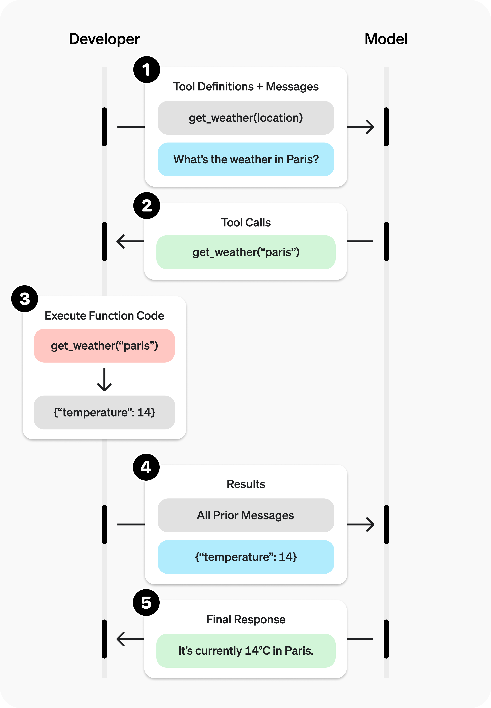

Function callingの概要 Function callingは、2023年6月にChat Completions APIに追加された機能です。簡単に言えば、利用可能な関数をLLMに伝えておいて、LLMに「関数を使いたい」という判断をさせる機能です（LLMが関数を実行するわけではなく、LLMは「関数を使いたい」という応答を返してくるだけです）。 LLMをアプリケーションに組み込んで活用するうえでは、LLMにJSONなどの形式で出力させて、その内容をもとにプログラム中の関数を実行するような処理を実装したいことは多いです。そのようなケースでLLMがうまく応答するように、APIの実装とモデルのファインチューニングをほどこしたのがFunction callingです。 MEMO Tool calling・Tool use Function callingと同様の機能は、LangChainではTool callingと呼ばれ、AnthropicのAPIではTool useと呼ばれます。 


https://platform.openai.com/docs/guides/function-calling?api-mode=chat


```python
from openai import OpenAI

client = OpenAI()

tools = [{
    "type": "function",
    "function": {
        "name": "get_weather",
        "description": "Get current temperature for a given location.",
        "parameters": {
            "type": "object",
            "properties": {
                "location": {
                    "type": "string",
                    "description": "City and country e.g. Bogotá, Colombia"
                }
            },
            "required": [
                "location"
            ],
            "additionalProperties": False
        },
        "strict": True
    }
}]

completion = client.chat.completions.create(
    model="gpt-4o",
    messages=[{"role": "user", "content": "What is the weather like in Paris today?"}],
    tools=tools
)

print(completion.choices[0].message.tool_calls)


# output
[{
    "id": "call_12345xyz",
    "type": "function",
    "function": {
        "name": "get_weather",
        "arguments": "{\"location\":\"Paris, France\"}"
    }
}]
```

