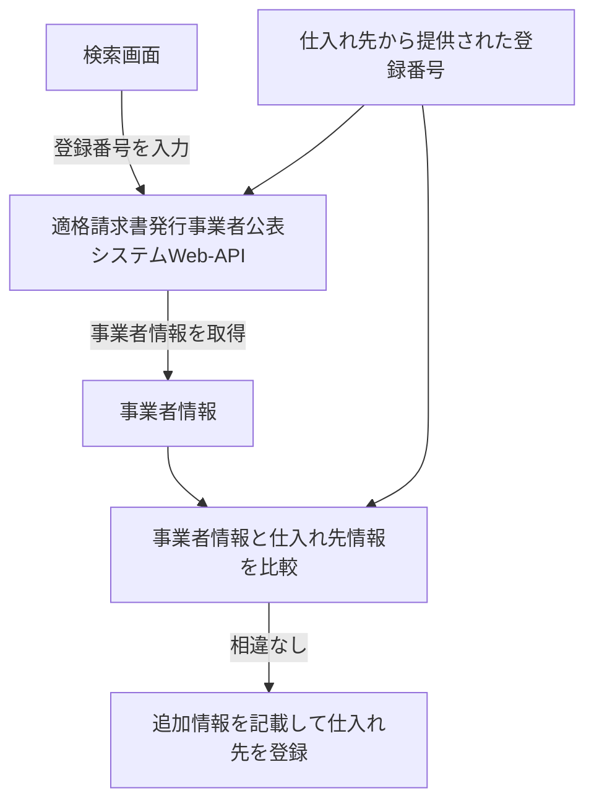

```mermaid
graph TD;
    A[検索画面] -->|登録番号を入力| B[適格請求書発行事業者公表システムWeb-API]
    B -->|事業者情報を取得| C[事業者情報]
    D[仕入れ先から提供された登録番号] --> B
    C --> E[事業者情報と仕入れ先情報を比較]
    D --> E
    E -->|相違なし| F[追加情報を記載して仕入れ先を登録]

```